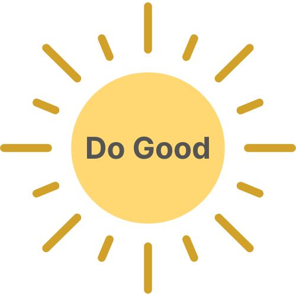
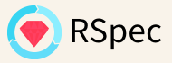
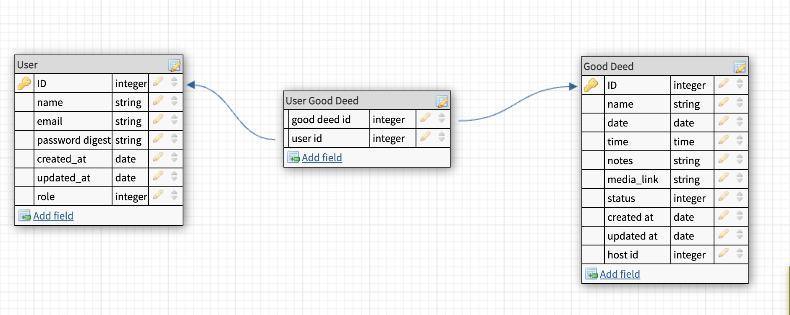

<!-- ReadMe -->

<!-- Opening -->
 

  

<h3 align="center">Welcome to Do Good</h3>
  

    Find the GOOD in the world.
    

    With the constant bombardment of negative news, it's easy to think there is no good left in the world. Do Good aims to increase the good by connecting people with opportunities to complete random acts of kindness in an approachable and fun way.
  

 

<!-- TABLE OF CONTENTS -->

  
Table of Contents

  <ol>
    <li>
      <a href="#about-the-project">About The Project</a>
      <ul>
        <li><a href="#built-with">Built With</a></li>
      </ul>
    </li>
    <li>
      <a href="#getting-started">Getting Started</a>
      <ul>
        <li><a href="#prerequisites">Prerequisites</a></li>
        <li><a href="#schema">Schema</a></li>
        <li><a href="#testing">Testing</a></li>
      </ul>
    </li>
    <li><a href="#endpoints">Endpoints</a></li>
    <li><a href="#apis">APIs Used</a></li>
    <li><a href="#technologies">Other Technologies Used</a></li>
    <li><a href="#contact">Contributors</a></li>
    <li><a href="#refactor">Future Iterations</a></li>
  </ol>

 

<!-- ABOUT THE PROJECT -->
## About The Project

   ☀️ [Production Website](https://cryptic-fortress-66693.herokuapp.com/)
    
   ☀️ [Backend Service](https://warm-temple-59633.herokuapp.com/)
    
   ☀️ [Front End Repository](https://github.com/do-good-2211/do_good_web)
    
   <!-- * [Video Presentation]() -->

  **Do Good** was created by Back End students at Turing School of Software and Design as their [consultancy project](https://backend.turing.edu/module3/projects/consultancy/).

  The mission of **Do Good** is to provide users with convenient access to positivity and an opportunity to be part of the good in the world.

  Users simply click the "Find a Random Act of Kindness" button and are presented with 3 random acts to choose from. Once chosen, they schedule the "good deed" and it gets added to their dashboard. Users are able to invite others to join in on the fun as well as add it to their calendars because, let's be real, life can get hectic.

  For visitors who aren't ready to jump into completing an act, they can browse our library of kind act photos for the feel-goods.

(<a href="#readme-top">back to top</a>)

<!-- Built With -->
### Built With

 
 

(<a href="#readme-top">back to top</a>)

<!-- GETTING STARTED -->
## Getting Started

If you'd like to demo this API on your local machine:
1. Ensure you have the prerequisites
2. Clone this repo: `git clone git@github.com:do-good-2211/do_good_api.git`
3. Navigate to the root folder: `cd do_good_api`
4. Run: `bundle install`
5. Run: `rails db:{create,migrate}`
6. Inspect the `/db/schema.rb` and compare to the 'Schema' section below to ensure migration has been done successfully
7. Run: `rails s`
8. Visit http://localhost:3000/

<!-- Prerequisites -->
### Prerequisites

- Ruby Version 3.1.1
- Rails Version 7.0.4.x
- Bundler Version 2.4.9

<!-- Schema -->
### Schema

<!-- Testing -->
### Testing
To test the entire spec suite, run `bundle exec rspec`.
*All tests should be passing.*

Happy path, sad path, and edge testing were considered and tested. When a request cannot be completed, an error object is returned.

  
Error Object

    <pre>
    <code>
{
  "errors": [
    {
      "status": "404"
      "title": "Invalid Request",
      "detail": [
        "Couldn't find User with 'id'=<id>"
         ]
     }
   ]
}
    </code>
  </pre>

(<a href="#readme-top">back to top</a>)

<!-- Endpoints -->
## Endpoints

  
<code>GET "/api/v1/good_deeds"</code>

  Response:
  <pre>
    <code>
{
  "data": [{
    "id": “1”,
    "type": “good_deeds",
    "attributes":{
        "name": "Deed",
        "media_link": "www.image.com/picture",
        "time": "2000-01-01T16:00:00.000Z",
        "date": "2023-01-01"
      }  
  }]
}
    </code>
  </pre>

  
<code>GET "/api/v1/random_acts"</code>

  Response:
  <pre>
    <code>
{
  "data": {
    "id": null,
    "type": “random_acts",
    "attributes":{
        "deed_names": ["Deed 1", "Deed 2", "Deed 3"]
    }  
  }
}
    </code>
  </pre>

  
<code>GET "/api/v1/users"</code>

  Response:
  <pre>
    <code>
{
  "data": [{
    "id": “1”,
    "type": “users",
    "attributes": { 
      "name": "Joe",
      "role": "user",
      "email": "joe@email.com",
      "good_deeds": {
        "id": 1,
        "type": "good_deed",
        "attributes": {
          "name": "Help Others",
            "date": "2023-01-01",
            "time": "2000-01-01T16:00:00.000Z",
            "status": "Completed",
            "notes": "Worth it!",
            "media_link": "https://image.com",
            "host_id": 1,
            "host_name": "Jean-Luc Picard",
            "attendees": [{
              "id": 2,
              "name": "William Riker",
              "email": "number2@gmail.com",
              "role": "user",
              "created_at": "2023-04-19T16:11:24.633Z",
              "updated_at": "2023-04-19T16:11:24.633Z",
              "uid": "22022",
              "provider": "Google"
            }
          ]
        }
      }
    }  
  }]
}
    </code>
  </pre>

  
<code>GET "/api/v1/users/:user_id"</code>

  Response
  <pre>
    <code>
  {
    "data": {
      "id": “1”,
      "type": “users",
      "attributes":{
      "name": "Sam",
      "role": "user",
      "email": "sam@email.com", 
      "good_deeds": [{
          "data": {[
          "id": “1”,
          "type": “good_deed",
          "attributes":{
              "name": "Deed",
              "media_link": "www.image.com/picture",
              "notes”: “ex description”,
              “date”: "02-02-2024",
              "time": "10:00,
              "status": "Completed", 
              "host_id": "1",
              "host_name": "Sam", 
              "attendees": [{
                "id": 2,
                "name": "William Riker",
                "email": "number2@gmail.com",
                "role": "user",
                "created_at": "2023-04-19T16:11:24.633Z",
                "updated_at": "2023-04-19T16:11:24.633Z",
                "uid": "22022",
                "provider": "Google" 
              }]
             }
            ]
          }
        }]
      }
    }
  }
    </code>
  </pre>

  
<code>GET "/api/v1/users/:user_id/good_deeds/:good_deed_id"</code>

  Response:
  <pre>
    <code>
{
  "data": {
    "id": "1",
    "type": "good_deed",
    "attributes": {
      "name": "Deed",
      “date”: "02-02-2024",
      "time": "10:00,
      "status": "in progress", 
      "attendees": [{
        "id": 1,
        "name": "William",
        "email": "william@email.com",
        "created_at": "2023-04-19T16:11:24.633Z",
        "updated_at": "2023-04-19T16:11:24.633Z",
        "uid": "22022",
        "provider": "Google"
      }]
    }  
  }
}
    </code>
  </pre>

  
<code>POST "/api/v1/users/:user_id/good_deeds"</code>

  Request Body:
  <pre>
    <code>
{
  "name": "Deed",
  "date": "02-02-2024",
  "time": "10:00",
  "host_id": "2",
  "status": "In Progress",
  "attendees": []
}
    </code>
  </pre>

  Response: 
  <pre>
    <code>
{
    "data": {
        "id": "6",
        "type": "good_deeds_create",
        "attributes": {
            "name": "Deed",
            "media_link": null,
            "notes": null,
            "date": "2024-02-02",
            "time": "2000-01-01T10:00:00.000Z",
            "status": "In Progress",
            "host_id": 1
        }
    }
}
    </code>
  </pre>

  
<code>PATCH "/api/v1/users/:user_id/good_deeds/:good_deed_id"</code>

  Request Body:
  <pre>
    <code>
{
  "name": "Deed",
  "date": "02-02-2024",
  "time": "10:00",
  "notes": "Stuff and things",
  "media_link": "picture.jpg"
}
    </code>
  </pre>

Response:

  <pre>
    <code>
{
    "data": {
        "id": "1",
        "type": "good_deed",
        "attributes": {
            "name": "Deed",
            "date": "2024-02-02",
            "time": "2000-01-01T10:00:00.000Z",
            "status": "Completed",
            "notes": "Stuff and things",
            "media_link": "picture.jpg",
            "host_id": 1,
            "host_name": "Jean-Luc Picard",
            "attendees": [
                {
                    "id": 2,
                    "name": "William Riker",
                    "email": "number2@gmail.com",
                    "role": "user",
                    "created_at": "2023-04-19T16:11:24.633Z",
                    "updated_at": "2023-04-19T16:11:24.633Z",
                    "uid": "22022",
                    "provider": "Google Baby!"
                }
            ]
        }
    }
}
    </code>
  </pre>

  
<code>DELETE "/api/v1/users/:user_id/good_deeds/:good_deed_id"</code>

  Response
  <pre>
    <code>
Status: 204
    </code>
  </pre>

(<a href="#readme-top">back to top</a>)

<!-- APIs Used -->
<h2 id="apis">APIs Used</h2>

[The BoredAPI](https://github.com/drewthoennes/Bored-API) was consumed to generate the random acts of kindness.

[Google Calendar API]() was used to create a calendar event on the user's Google Calendar.

(<a href="#readme-top">back to top</a>)

<!-- Other Technologies Used -->
<h2 id="technologies">Other Technologies Used</h2>

[Google Cloud Platform](https://cloud.google.com/) was used to allow users to sign in with their Google account.

[Amazon Web Services](https://aws.amazon.com/) was used to allow users to upload photos for their completed good deeds.

[Twilio SendGrid](https://sendgrid.com/) was used to send an email to the user after they create a good deed

  
<strong> Email Service</strong>
 
    
Users will receive a message

 

(<a href="#readme-top">back to top</a>)

<!-- Future Iterations -->

<h2 id="refactor">Future Iterations</h2>
<!-- <li></li>
<li></li> -->

<dl>
  <dt>Idea 1</dt>
    <dd>- Stuff bit 1</dd>
    <dd>- Stuff bit 2</dd>
  <dt>Idea 2</dt>
    <dd>- Stuff bit 1</dd>
    <dd>- Stuff bit 2</dd>
</dl>

(<a href="#readme-top">back to top</a>)

<!-- CONTACT -->
<!-- ## Contributors -->
<h2 id="contact">Contributors</h2>

|  |  |  |  |  |  |
| ------------------ | ------------ | -------------- | ----------- | -------------- | ----------- |
| Huy Phan | Jasmine Hamou | Kara Jones-Hofmann | Matt Enyeart | Melony Erin Franchini | Mike Dao |
| Collaborator | Collaborator | Collaborator | Collaborator | Collaborator | Project Manager |
| [GitHub](https://github.com/HuyPhan2025) | [GitHub](https://github.com/hamouj) | [GitHub](https://github.com/KaraJoHo) | [GitHub](https://github.com/menyeart) | [GitHub](https://github.com/MelTravelz) | [GitHub](https://github.com/mikedao) |
| [LinkedIn](https://www.linkedin.com/in/huy-phan-2471b3261/) |  [LinkedIn](https://www.linkedin.com/in/jasmine-hamou/) | [LinkedIn](https://www.linkedin.com/in/81012911-91208/) | [LinkedIn](https://www.linkedin.com/in/matt-enyeart/) | [LinkedIn](https://www.linkedin.com/in/melony-erin-franchini/) | [LinkedIn](https://www.linkedin.com/in/michaeldao/) |

(<a href="#readme-top">back to top</a>)

